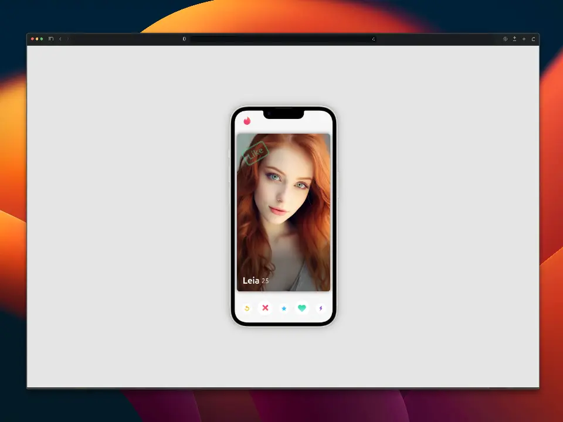

🔥 Tinder Swipe
===============

Proyecto en JavaScript puro para crear el efecto "deslizar" (swipe en inglés) de la aplicación Tinder.

Conceptos
---------

- Document Object Model (DOM).
- Animaciones con gestos.
- Eventos del ratón e interacción con los dedos en un dispositivo móvil.
- Transiciones CSS.