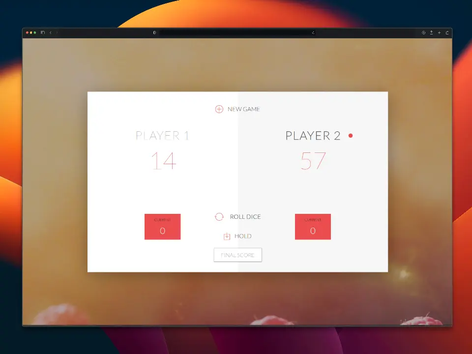

🎲 Pig Dice Game
================

Proyecto para practicar la manipulación del Document Object Model (DOM), modelando el juago de dados [Pig](https://en.wikipedia.org/wiki/Pig_(dice_game)).

Reglas del juego
----------------

- El juego tiene 2 participantes y una dinámica de turnos.
- En cada ronda 1 jugador arroja los dados tantas veces como desee. Cada resultado se suma a su puntaje de ronda.
- Pero si el jugador obtiene u 1 en el dado, todo el puntaje de su ronda se pierde y el turno cambia al otro participante.
- El participante puede escoger la opciones 'Hold' para acumular su puntaje en el marcador global y seder el turno al otro participante.
- El primer jugador en alcanzar 100 punto en el marcado global gana el juego.

Conceptos
---------

- Manipulación del Document Object Model (DOM).
- Lectura del Document Object Model (DOM).
- Crear un número aleatoreo usando el objeto [Math](https://developer.mozilla.org/en-US/docs/Web/JavaScript/Reference/Global_Objects/Math).
- Actualización de estilos CSS.