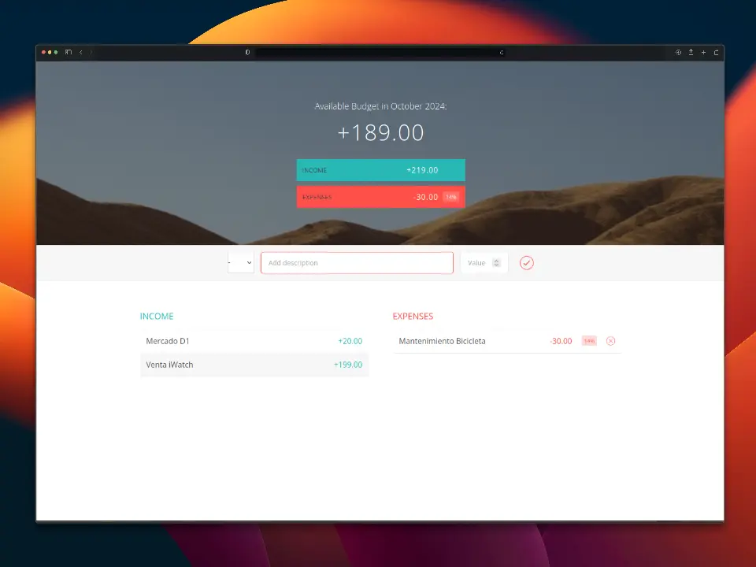

💸 Budgety
==========

Proyecto en JavaScript puro para practicar el sistema de módulos modelando una calculadora de presupuesto.

Conceptos
---------

- Módulos en JavaScript.
  - Módulo de UI, para tener los datos de entrada
  - Módulo de datos, para agregar un ítem a nuestra estructura de datos.
  - Módulo controlador, para atender los eventos del usuario.
- Arquitectura por controladores.
- Eventos del teclado.
