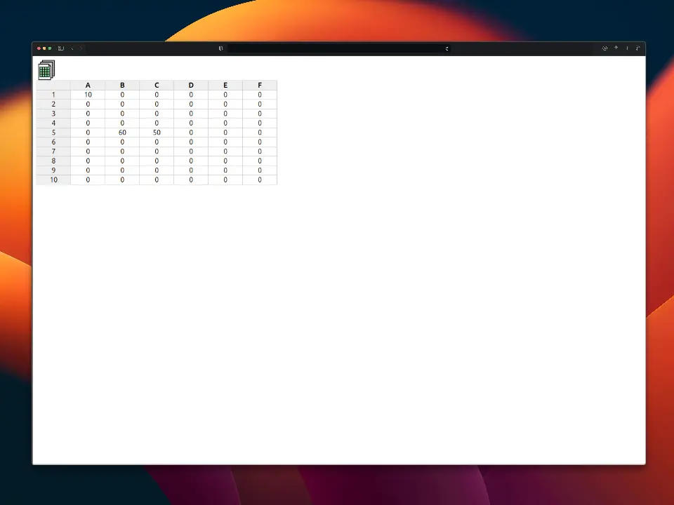

🗓️ Spreadsheet
==============

Proyecto en JavaScript que emula una hoja de cáclulo.

Conceptos
---------

- Tablas HTML.
- Eventos de entrada manipulados con `focus` y `blur`.
- Usos y advertencias de la función [`eval`](https://developer.mozilla.org/es/docs/Web/JavaScript/Reference/Global_Objects/eval).
