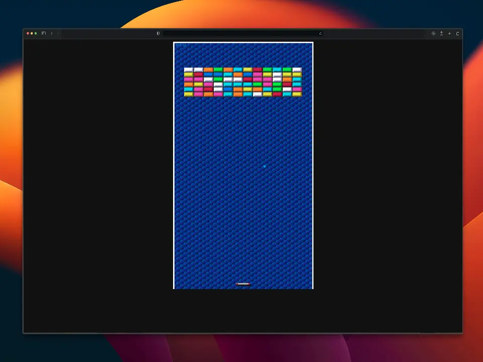

🎮 Arkanoid
===========

Proyecto en JavaScript que emula el mítico y clásico juego Arkanoid controlado a través del teclado.

Conceptos
---------

- Dibujo en el elemento HTML [canvas](https://developer.mozilla.org/es/docs/Web/HTML/Element/canvas).
- Eventos del teclado.
- Tecnica de spritesheets.
- Uso del método [requestAnimationFrame](https://developer.mozilla.org/es/docs/Web/API/Window/requestAnimationFrame).

